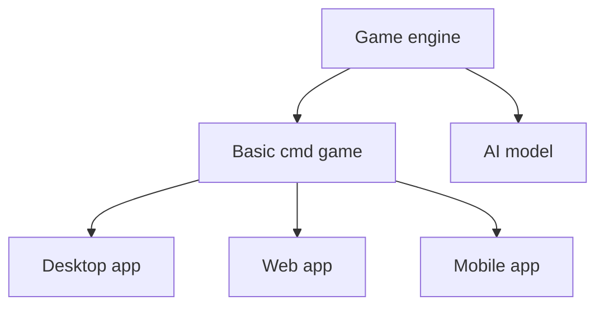

# ChessProject
The Chess Project is an implementation of chess in Python language. It is intended for incremental development of programming skills by increasing the complexity of tasks and extending functionalitites.

## Development plan
Development plan includes possible stages of chess development, depending on desired skills.

## Game engine
The game engine runs on python X.X. The moves and validation are in development.
