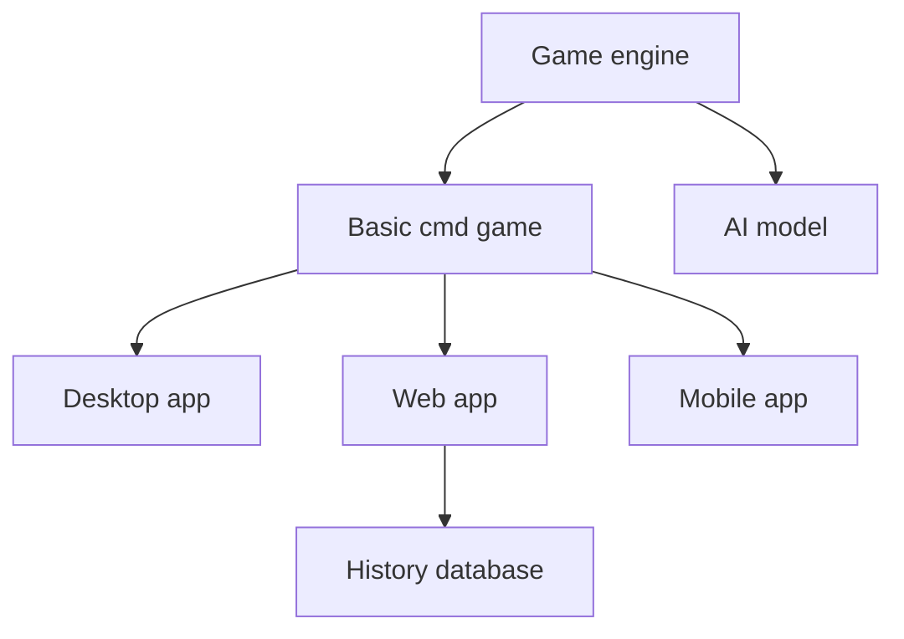

# ChessProject
The Chess Project is an implementation of chess in Python language. It is intended for incremental development of programming skills by increasing the complexity of tasks and extending functionalitites.

## Development plan
Development plan includes applications and software that can be made as extensions of the basic functionalities.

The selection which app will be developed depends on desired skills to develop.

## Game engine
The game engine runs on python X.X. The moves and validation are in development.
